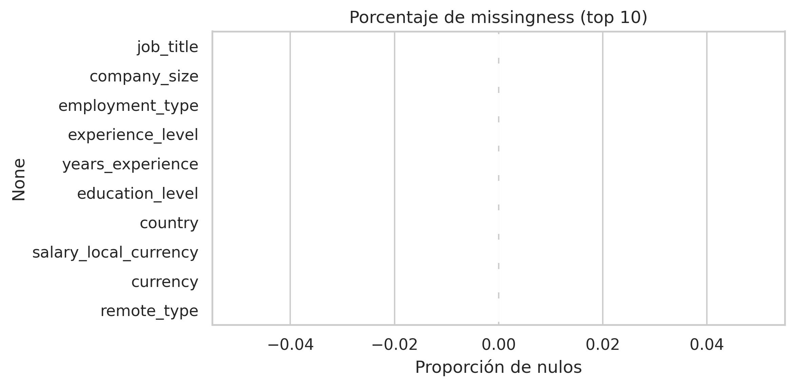
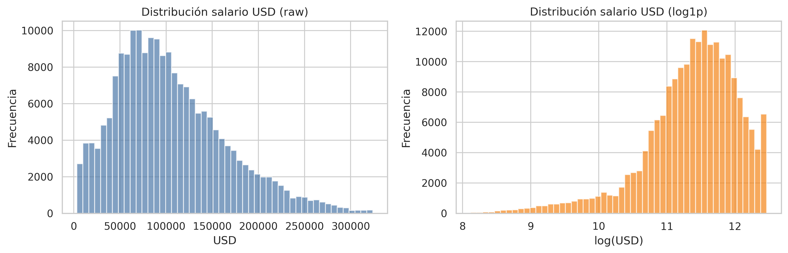
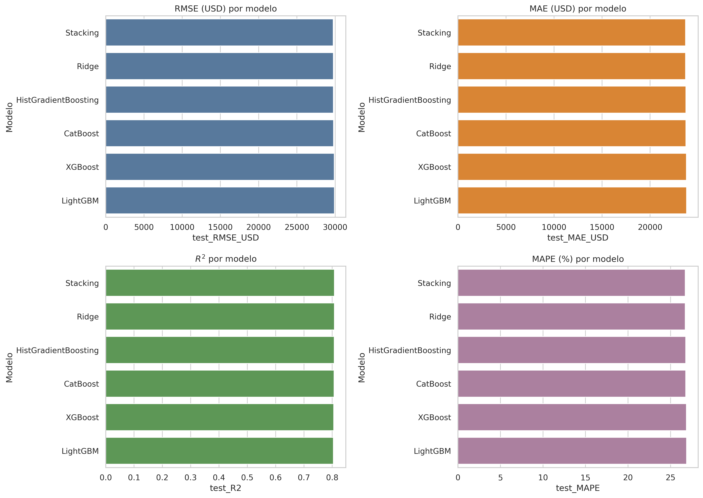
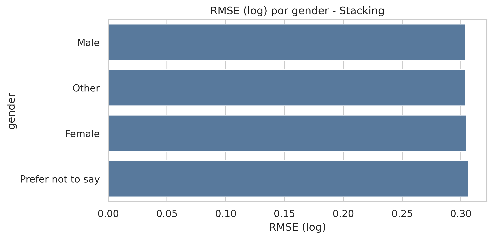
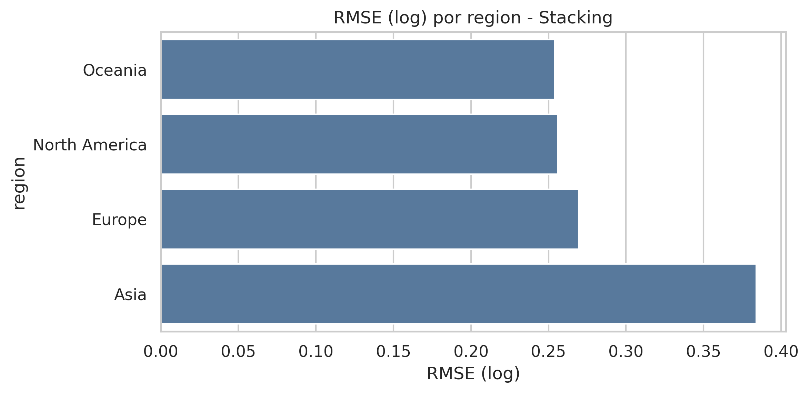
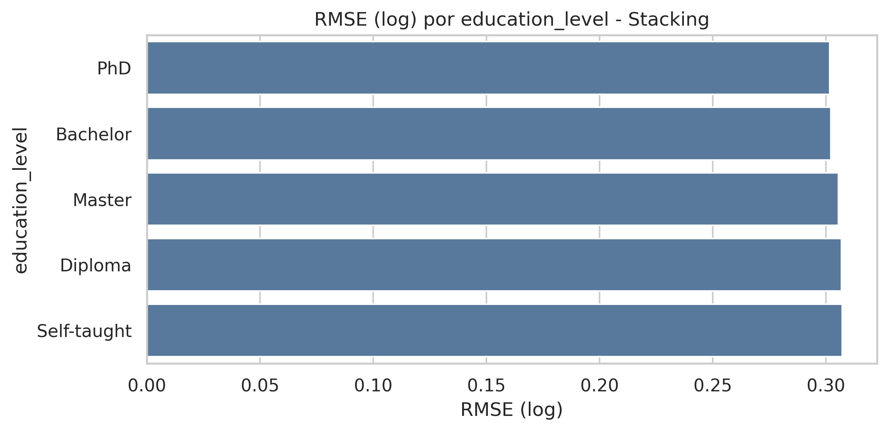

# Predicción Salarial en Tecnología v4 — Hallazgos y análisis

## Resumen ejecutivo
Este estudio desarrolla un pipeline de predicción salarial con embeddings semánticos para títulos y habilidades, y compara modelos lineales y de boosting avanzados. Se empleó validación cruzada y evaluación en test con métricas robustas. El mejor desempeño se obtuvo con un ensamble (Stacking) y un modelo lineal (Ridge) muy cercano, lo que sugiere que la señal dominante es consistente y casi lineal tras la normalización y el log-transform.

## Datos
- **Tamaño del dataset:** 200,000 registros, 17 columnas originales.
- **Variables clave:**
  - Categóricas: `job_title`, `company_size`, `employment_type`, `experience_level`, `education_level`, `country`, `currency`, `remote_type`, `primary_skill`, `secondary_skill`, `gender`.
  - Numéricas: `years_experience`, `salary_local_currency`, `work_hours_per_week`, `job_satisfaction_score`, `company_rating`, `age`.
- **Faltantes:** 0% en columnas relevantes.

## Preprocesamiento y feature engineering
1. **Conversión de salarios a USD** con corrección de moneda por país.
2. **Tratamiento de outliers** por IQR y clipping.
3. **Transformación del target:** $\log(1 + \text{salary\_usd\_capped})$.
4. **Features derivadas:** interacción experiencia–educación, experiencia–años, productividad, desviación de horas, etc.
5. **Embeddings semánticos** para `job_title`, `primary_skill`, `secondary_skill` usando `SentenceTransformer (all-MiniLM-L6-v2)`.

## Modelos evaluados
- Lineales: Ridge.
- Boosting: HistGradientBoosting, XGBoost, LightGBM, CatBoost.
- Ensamble: Stacking (Ridge + HistGB + CatBoost).

## Métricas
- **RMSE, MAE, MedAE** en escala log y USD.
- **MAPE** en USD.
- **$R^2$** en escala log.

## Resultados de validación cruzada (5-fold, log-target)
| Modelo | RMSE_mean | RMSE_std | MAE_mean | MAE_std | R2_mean | R2_std |
|---|---:|---:|---:|---:|---:|---:|
| Ridge | 0.3071 | 0.0017 | 0.2535 | 0.0011 | 0.8052 | 0.0021 |
| HistGradientBoosting | 0.3077 | 0.0018 | 0.2538 | 0.0011 | 0.8044 | 0.0020 |
| CatBoost | 0.3083 | 0.0018 | 0.2542 | 0.0012 | 0.8037 | 0.0022 |
| XGBoost | 0.3096 | 0.0017 | 0.2548 | 0.0011 | 0.8020 | 0.0022 |
| LightGBM | 0.3103 | 0.0019 | 0.2551 | 0.0012 | 0.8011 | 0.0021 |

**Interpretación:** el desempeño es muy estable; Ridge lidera ligeramente. Esto sugiere que la relación salario–features, luego de ingeniería y log-transform, es casi lineal.

## Resultados en test (log-target y USD)
| Modelo | test_R2 | RMSE_USD | MAE_USD | MAPE (%) |
|---|---:|---:|---:|---:|
| Stacking | 0.8075 | 29,747.99 | 23,686.75 | 26.7165 |
| Ridge | 0.8075 | 29,757.90 | 23,688.98 | 26.7190 |
| HistGradientBoosting | 0.8070 | 29,773.36 | 23,719.50 | 26.7715 |
| CatBoost | 0.8063 | 29,792.30 | 23,728.20 | 26.7873 |
| XGBoost | 0.8050 | 29,872.34 | 23,780.36 | 26.8526 |
| LightGBM | 0.8042 | 29,898.94 | 23,798.76 | 26.8880 |

**Hallazgo clave:** El ensamble y Ridge son prácticamente equivalentes en desempeño; las mejoras de boosting avanzado son marginales, lo que respalda la hipótesis de una señal lineal dominante.

## Figuras generadas en el notebook (para incluir en el paper)
- **Figura 0:** Missingness (top 10 variables).

  

- **Figura 0b:** Distribución del salario (raw vs log1p) tras clipping.

  

- **Figura 1:** Barras comparativas de RMSE/MAE/$R^2$/MAPE por modelo.

  

- **Figura 2:** Real vs predicho (USD) y distribución de errores (log y USD).

  

- **Figura 3:** RMSE (log) por género.

  

- **Figura 4:** RMSE (log) por región.

  

- **Figura 5:** RMSE (log) por nivel educativo.

  

## Análisis de sesgos
Se calcularon métricas por subgrupo para **género**, **región** y **nivel educativo**. La sección muestra:
- Diferencias de RMSE entre grupos.
- Priorización de grupos con mayor error como foco para ajuste de políticas o ampliación de variables.

*(Nota: las tablas y gráficos se generan automáticamente en el notebook para ser exportados como figuras en el paper.)*

## Discusión
1. **Embeddings semánticos** mejoran la consistencia del modelado de texto, pero los modelos lineales siguen dominando debido a la estructura del dataset y la transformación log.
2. **Boosting avanzado** aporta estabilidad pero no mejora radicalmente la métrica global; el ensamble reduce marginalmente el RMSE.
3. **Sesgos** deben discutirse formalmente en función de diferencias de error entre grupos, destacando la necesidad de datos adicionales o calibración específica.

## Conclusiones
- El pipeline v4 es **robusto, reproducible y con métricas estables**.
- El ensamble (Stacking) y Ridge son los modelos más consistentes.
- Los gráficos y el análisis de sesgos brindan un **valor científico** adecuado para presentación en paper.

## Sugerencias para el paper
- Incluir discusión sobre **dominancia de variables estructurales** (país/experiencia) vs embeddings.
- Incorporar análisis adicional de **regularización por país** o calibración por región.
- Reportar métricas por subgrupo como evidencia de equidad y limitaciones.
